# 📱 Fake Cloud Society App (FCS-App)

Bienvenue dans le projet **Fake Cloud Society App**, une application mobile développée avec **React Native**, **Expo** et **TypeScript** dans le cadre de notre projet d’école. L'application propose une expérience de connexion sécurisée, un tableau de bord dynamique, un profil utilisateur éditable, et bien plus encore.

---

## 🚀 Fonctionnalités principales

- 🔐 **Authentification sécurisée** avec `SecureStore`
- ✅ **Persistance de session**
- 🧑‍💼 **Édition du profil utilisateur** (nom, prénom, pays, etc.)
- 🌐 **Navigation protégée** par un système de `ProtectedRoute`
- 🧾 **Connexion API** RESTful avec `fetch`
- 🔒 **SSL Pinning** pour sécuriser les requêtes réseau
- 🧠 **Form validation** avec `zod` et `react-hook-form`

---

## 🛠️ Technologies utilisées

- [Expo](https://expo.dev/)
- [React Native](https://reactnative.dev/)
- [TypeScript](https://www.typescriptlang.org/)
- [Zod](https://zod.dev/) pour la validation de formulaire
- [React Hook Form](https://react-hook-form.com/)
- [Expo Secure Store](https://docs.expo.dev/versions/latest/sdk/securestore/)
- [Lucide Icons](https://lucide.dev/)

---

## 📷 Capture d'écran

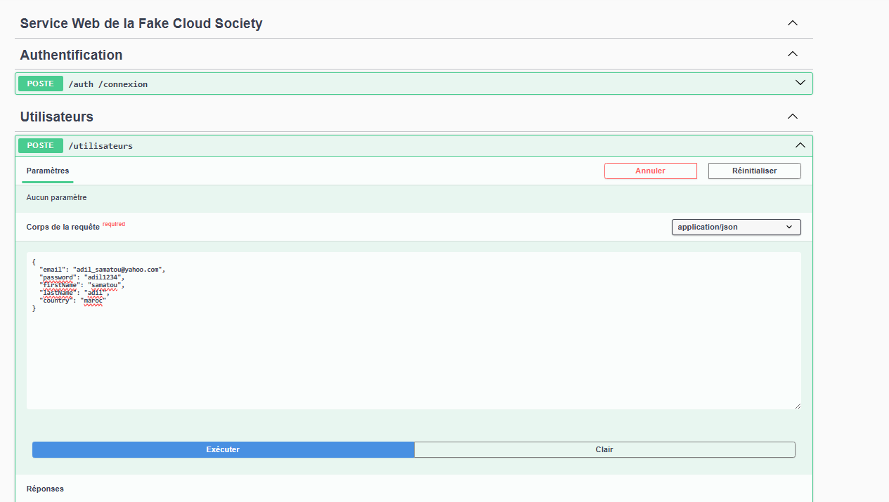
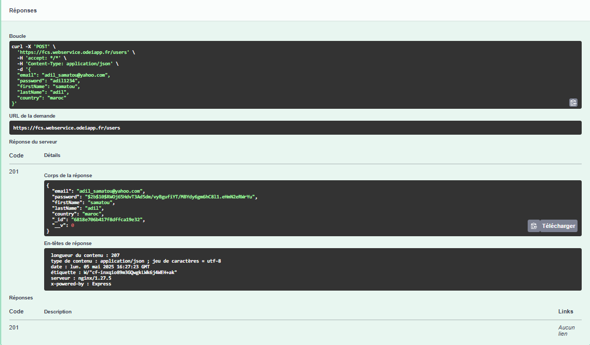
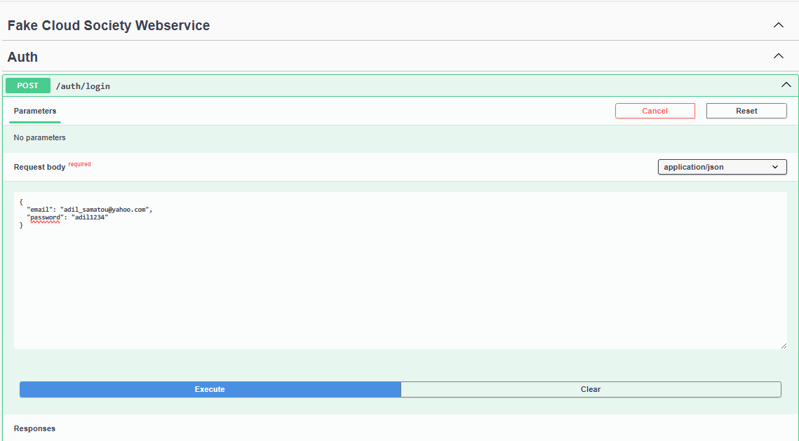
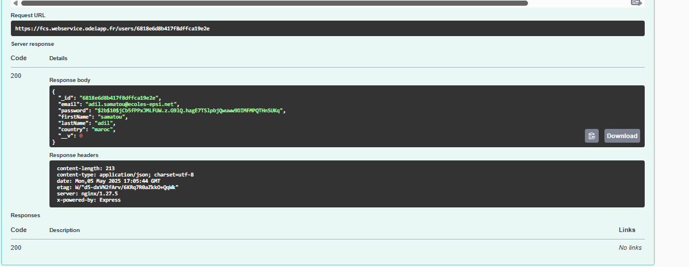
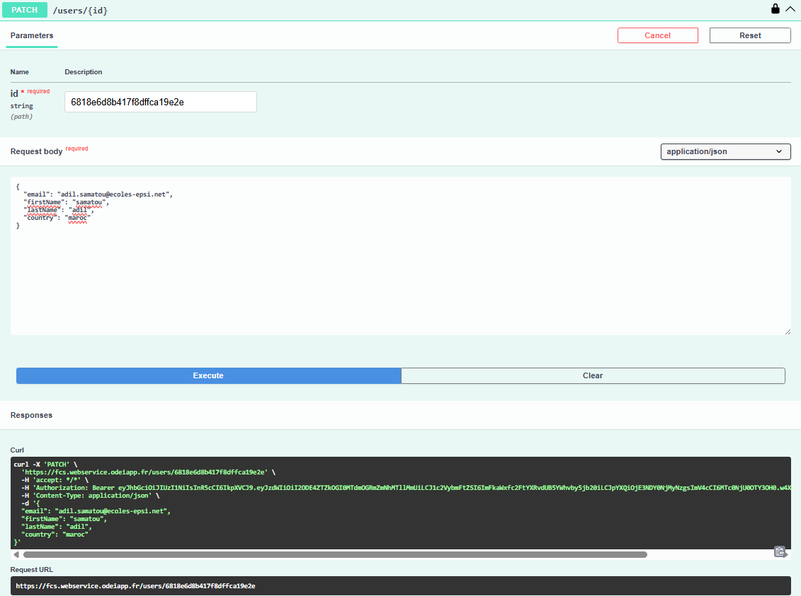
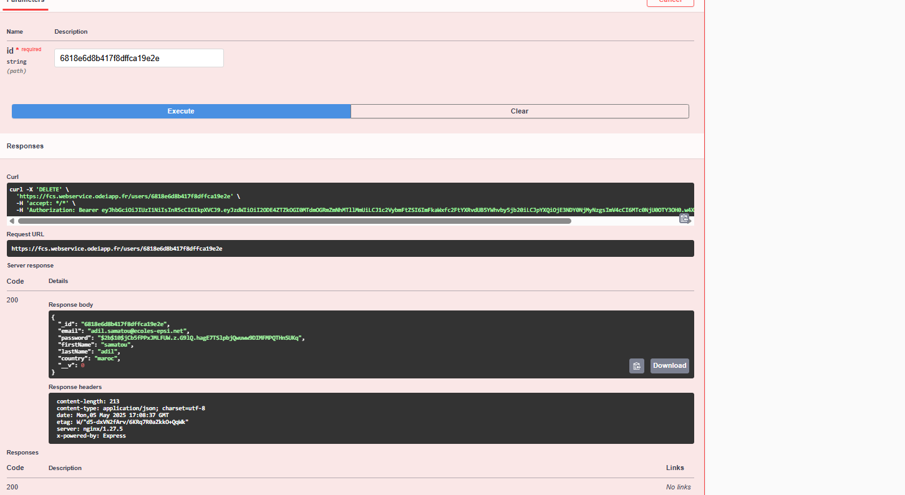
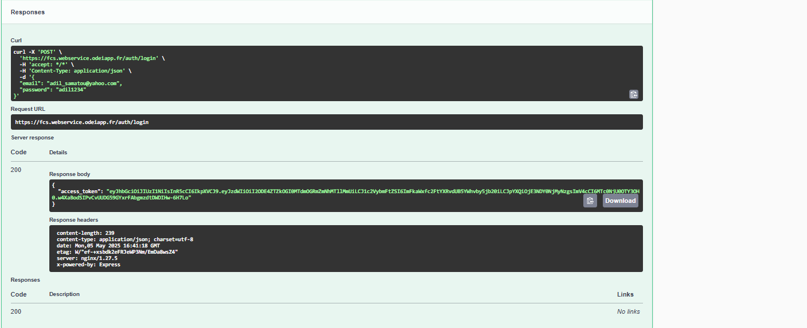
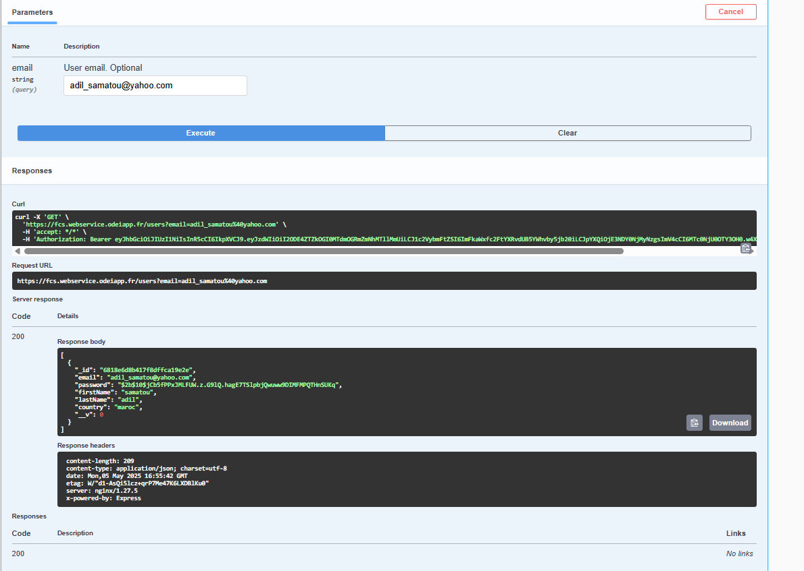
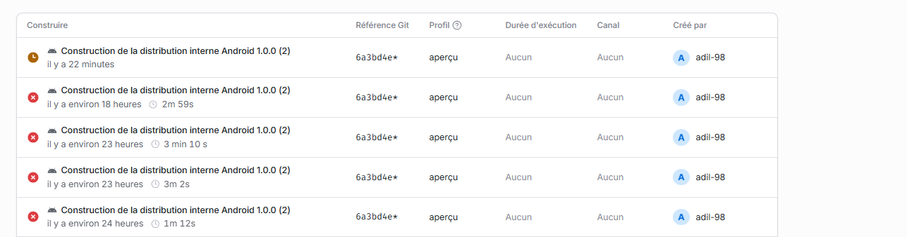
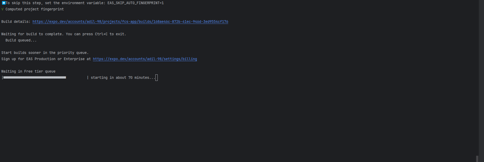
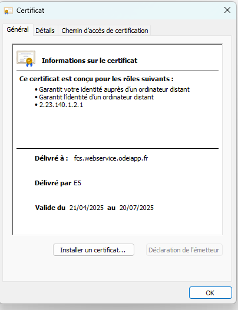


---

## 🧪 Installation locale

1. **Cloner le dépôt :**

```bash
git clone https://github.com/Adilovic48/Atelier-S-curit-Applicative.git
cd FCS-App
```

2. **Installer les dépendances :**

```bash
npm install
```

3. **Lancer le projet :**

```bash
npx expo start
```

---

## 📦 Générer un APK

```bash
eas build --platform android
```

> ⚠️ Vous devez avoir un compte Expo et EAS configuré. Vous pouvez aussi lancer l'application dans un émulateur avec :

```bash
npx expo run:android
```

---

## 🔐 SSL Pinning

Nous avons utilisé `expo-network` + certificat `.cer` stocké dans `android/app/src/main/res/raw/odeiapp.cer` pour vérifier l’authenticité des requêtes.

---

## 🧾 Routes protégées

Un composant `ProtectedRoute.tsx` protège toutes les pages sensibles de l’application. Si l’utilisateur n’est pas authentifié, il est redirigé vers `/auth/signin`.

---

---

## 👨‍💻 Auteur

- **Nom** : Samatou Adil
- **École** : EPSI
- **Classe** : SN2
- **Projet** : Atelier Sécurité Applicative

---

## 📁 Arborescence

```
FCS-App/
├── app/
│   ├── auth/
│   ├── dashboard/
│   └── ...
├── assets/
├── constants/
├── components/
├── android/
├── .gitignore
├── README.md
└── eas.json
```

---

## 📄 Licence

Ce projet est à but pédagogique dans le cadre de l’école EPSI.
